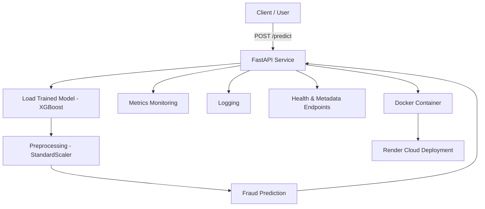

# 💳 Credit Card Fraud Detection API

[](https://creditcard-fraud-detection-1-1078.onrender.com)
[]
[]
[]
[]

---

## 🚀 Live API

🌍 **Deployed on Render:**  
https://creditcard-fraud-detection-1-1078.onrender.com

📘 **Swagger Documentation:**  
https://creditcard-fraud-detection-1-1078.onrender.com/docs

---

# 📌 Project Overview

This project detects fraudulent credit card transactions using machine learning and deploys the trained model as a production-ready API.

The dataset is highly imbalanced (~0.17% fraud cases), requiring specialized techniques such as:

- Class imbalance handling
- Feature scaling
- Threshold tuning
- Precision-Recall optimization

The trained model is deployed using:

- **FastAPI**
- **Docker**
- **Render Cloud**
- **Prometheus Monitoring**
- **CI/CD Auto Deployment**

---

# 🏗 System Architecture


---

# 📊 Dataset

Dataset from Kaggle:

https://www.kaggle.com/datasets/mlg-ulb/creditcardfraud

### Dataset Features

| Feature | Description |
|----------|------------|
| Time | Seconds since first transaction |
| V1–V28 | PCA-transformed confidential features |
| Amount | Transaction amount |
| Class | Target (0 = Genuine, 1 = Fraud) |

### Class Distribution

- Non-Fraud: 284,315 (~99.8%)
- Fraud: 492 (~0.17%)

Highly imbalanced dataset.

---

# 🧠 Machine Learning Approach

| Step | Description |
|------|------------|
| Data Exploration | Studied imbalance & correlations |
| Preprocessing | Scaling + handling imbalance |
| Model Training | XGBoost with scale_pos_weight |
| Evaluation | Precision, Recall, F1, ROC-AUC, AUPRC |
| Threshold Tuning | Optimized fraud detection tradeoff |

---

# 🏆 Final Model

### ✅ XGBoost Classifier

| Metric | Score |
|--------|--------|
| ROC-AUC | 0.98+ |
| AUPRC | 0.87 |
| F1 Score (Fraud) | ~0.86 |
| Precision | High |
| Recall | High |

Fraud detection is primarily driven by PCA behavioral features (V14, V17, V12).

---

# 🔌 API Endpoints

| Endpoint | Method | Description |
|-----------|--------|------------|
| `/` | GET | Service check |
| `/health` | GET | Health status |
| `/metadata` | GET | Model metadata |
| `/predict` | POST | Fraud prediction |
| `/metrics` | GET | Prometheus metrics |

---

## 🔍 Example Request

```json
POST /predict

{
  "features": [0,0,0,0,0,0,0,0,0,0,0,0,0,0,0,0,0,0,0,0,0,0,0,0,0,0,0,0,0,100]
}
```

---

## 🔁 Example Response

```json
{
  "fraud_probability": 0.00000118,
  "prediction": 0
}
```

---

# 📈 Monitoring

The API exposes Prometheus-compatible metrics:

```
GET /metrics
```

Example:

```
# HELP total_predictions Total number of predictions made
# TYPE total_predictions counter
total_predictions 5.0

# HELP fraud_predictions Total number of fraud predictions
# TYPE fraud_predictions counter
fraud_predictions 1.0
```

Tracks:

- Total predictions
- Fraud predictions

---

# 🐳 Docker Deployment

Build image:

```bash
docker build -t fraud-api .
```

Run container:

```bash
docker run -p 8000:8000 fraud-api
```

---

# 🔁 Continuous Deployment

Every push to the `main` branch automatically triggers:

- Docker rebuild
- Dependency installation
- Model loading
- Deployment on Render

This project implements CI/CD using GitHub → Render integration.

---

# 📂 Project Structure

```
creditcard-fraud-detection/
│
├── app/
│   ├── api.py
│   ├── utils.py
│   ├── schema.py
│
├── models/
│   └── fraud_system.pkl
│
├── src/
│   └── train.py
│
├── Dockerfile
├── requirements.txt
└── README.md
```

---

# 🏁 How To Train Model

```bash
python src/train.py
```

Model will be saved inside:

```
models/fraud_system.pkl
```

---

# 🛠 Tech Stack

- Python 3.10
- FastAPI
- XGBoost
- Scikit-learn
- Prometheus
- Docker
- Render Cloud
- GitHub CI/CD

---

# 📌 Resume Highlight

Built and deployed a production-ready Fraud Detection API using FastAPI, XGBoost, Docker, Prometheus monitoring, and CI/CD auto-deployment on Render.

---

# 👩‍💻 Author

Niranjana2599
